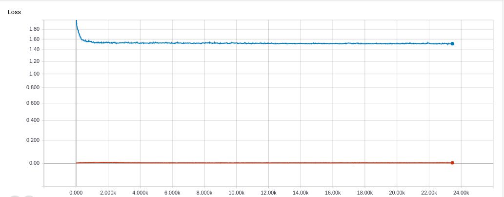
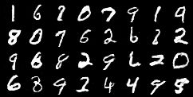
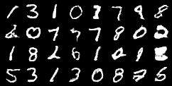
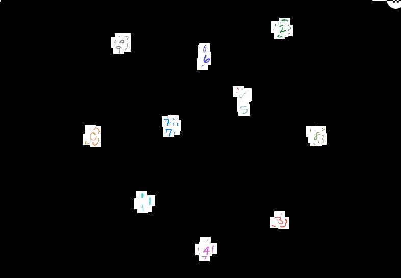
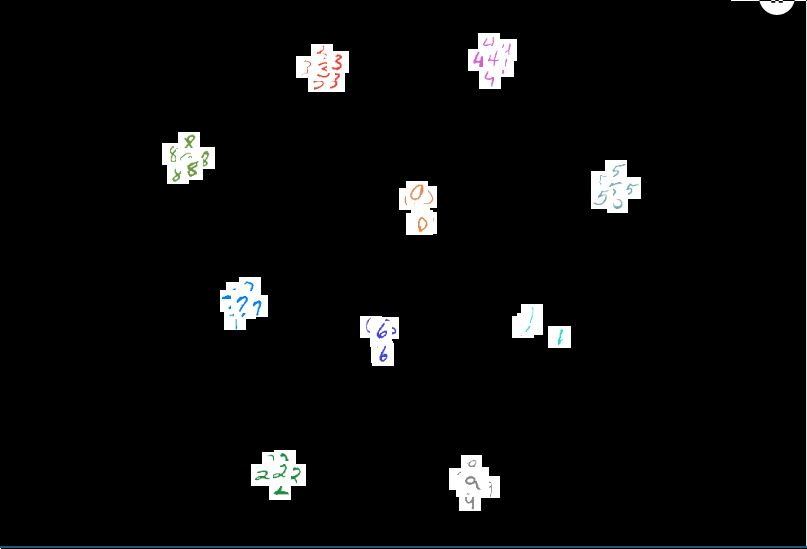

# TripletGAN

Implementation of the paper [Training Triplet Networks with GAN](https://arxiv.org/abs/1704.02227)

## Setup

The code is dependent on the following major packages.
- **pytorch==1.5.0**
- **torchvision==0.6.0**
- matplotlib
- scikit-learn 

One can also use the image from `nvcr.io/nvidia/pytorch:19.10-py3` to run this code.
A `pip freeze` of our dependencies can be found in `requirements.txt`. 


## Files

* `notebooks/tain_triplet_gan_experiment.ipynb`: a notebook that contains the a working training code for TripletGAN and its evaluation using K-NN. This is the recommended method for using this code.
* `src/dataset.py`: Pytorch Dataset for creating a Triplet MNIST dataset.
* `src/losses.py`: various loss functions like Triplet Loss(as per in the paper), Unsupervised Discriminator loss, Feature Matching loss.
* `src/model.py`: the model code for Generator and Discriminator. 
* `src/train.py`: a template code for training the TripletGAN and loading dataset

## Results


###  Training Loss


### Generated Images




### T-SNE of feature vector of the discriminator





### K-NN evaluation

Each model has been trained for **50 epochs** where **each epoch had exactly 60,000 randomly selected triplets**.    
The table below shows the performance of classification on test dataset of MNIST using a KNeighborsClassifier with `k = 9`.  
`N` is the number of training examples used from for training the 9-NN.    
`m` is the size of feature vector produced by the discriminator. 

<table>
  <tr>
   <td>(9-NN for N=100)
   </td>
   <td>m=16
   </td>
   <td>m=32
   </td>
  </tr>
  <tr>
   <td>Accuracy
   </td>
   <td>0.989
   </td>
   <td>0.9903
   </td>
  </tr>
  <tr>
   <td>mAP
   </td>
   <td>0.99151
   </td>
   <td>0.99253
   </td>
  </tr>
</table>


<table>
  <tr>
   <td>(9-NN for m=16)
   </td>
   <td>N=100
   </td>
   <td>N=200
   </td>
  </tr>
  <tr>
   <td>Accuracy
   </td>
   <td>0.9890
   </td>
   <td>0.9898
   </td>
  </tr>
  <tr>
   <td>mAP
   </td>
   <td>0.99151
   </td>
   <td> 0.99178
   </td>
  </tr>
</table>


The accuracy I found is considerably higher than what was reported in the paper. A possible reason for it might be that they trained there GAN only use 100 labeled examples from the training set whereas I used all of the training examples. 

But the good thing is the accuracy follows the intuition of increasing when we go from m=16 to m=32 and from N=100 to N=200.


## References: 

- For DCGAN (the basic template of this code was taken from here)
    - https://pytorch.org/tutorials/beginner/dcgan_faces_tutorial.html
- For various hacks for gan models and trainings:
    - https://github.com/soumith/ganhacks/
    - https://github.com/Sleepychord/ImprovedGAN-pytorch
- For details related to the paper:
    - https://github.com/maciejzieba/tripletGAN
    - https://arxiv.org/pdf/1704.02227.pdf
 
 ## Citation
 
 ```
 @article{DBLP:journals/corr/ZiebaW17,
  author    = {Maciej Zieba and
               Lei Wang},
  title     = {Training Triplet Networks with {GAN}},
  journal   = {CoRR},
  volume    = {abs/1704.02227},
  year      = {2017},
  url       = {http://arxiv.org/abs/1704.02227},
  archivePrefix = {arXiv},
  eprint    = {1704.02227},
  timestamp = {Tue, 02 Apr 2019 14:45:28 +0200},
  biburl    = {https://dblp.org/rec/journals/corr/ZiebaW17.bib},
  bibsource = {dblp computer science bibliography, https://dblp.org}
}
```
